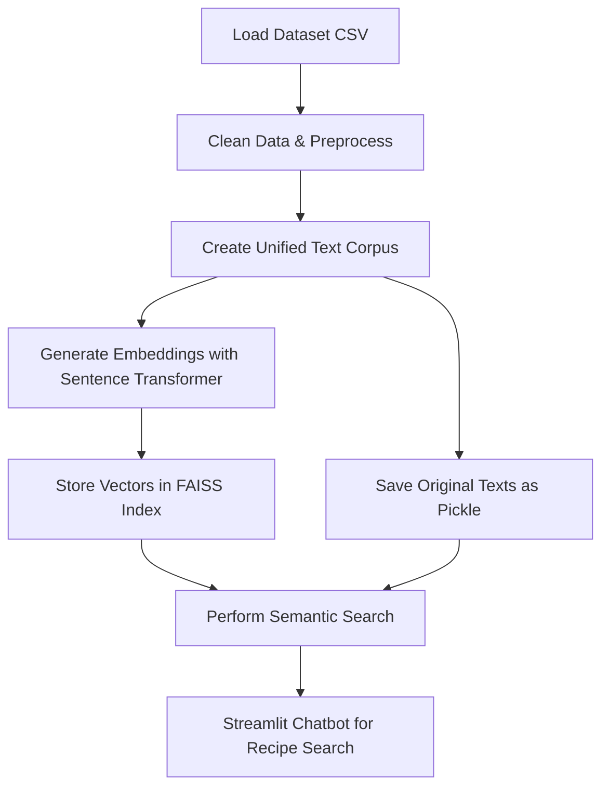

# 🍲 Recipe Retrieval-Augmented Generation (RAG) Chatbot

This project is a **Recipe Retrieval-Augmented Generation (RAG) system** that allows users to search and explore cooking recipes using **semantic search** powered by **FAISS** and **Sentence Transformers**.  
It also comes with a **Streamlit-based web app** for interactive recipe search and chatbot experience.

---

## ✨ Live Demo

You can try the live application, deployed via Streamlit, using the link below.

**[➡️ Visit the Live Recipe Assistant Here! ⬅️](https://cookingrecipechatbot.streamlit.app/)**  

!!Please use English command because of limited dataset and open using PC/Laptop is recommended!!

---

## 🚀 Key Features

-   **Natural Language Search**: Ask anything, like "how to make pancakes" or "chocolate cake ingredients".
-   **Comprehensive Information**: Get a clear list of ingredients and step-by-step cooking directions.
-   **Interactive Interface**: A modern and user-friendly chatbot interface powered by Streamlit.
-   **Fast Search**: Utilizes FAISS for lightning-fast recipe searches, even with tens of thousands of records.

---

## ⚙️ Tech Stack

-   **Frontend**: Streamlit
-   **Data Processing**: Pandas, NumPy
-   **Embedding Model**: Sentence Transformers (`all-MiniLM-L6-v2`) from Hugging Face
-   **Vector Database**: FAISS (Facebook AI Similarity Search)
-   **Backend Logic**: Python

---

## 📊 End-to-End Data Pipeline Flowchart



---

## 🛠️ How It Works

This project implements a simple RAG architecture for a recipe search system.

1.  **Indexing Pipeline (Offline)**:
    -   The recipe dataset is first cleaned, where relevant columns like title, ingredients, and directions are combined into a single text document for each recipe.
    -   Each of these text documents is then converted into a numerical representation (a vector) using the `all-MiniLM-L6-v2` model. This vector captures the semantic meaning of each recipe.
    -   All recipe vectors are stored in a FAISS index. FAISS allows us to search for the most similar vectors with incredible speed.

2.  **Retrieval Pipeline (Online)**:
    -   When you type a query into the Streamlit app, your query is also converted into a vector using the same model.
    -   This query vector is then used to find the most similar recipe vectors (those that are geometrically closest) within the FAISS index.
    -   After retrieving the most relevant recipes, the application fetches their original text and displays it to you in a user-friendly format.

---

## 💻 Local Installation & Setup

To run this project on your local machine, follow these steps:

1.  **Clone this repository:**
    ```bash
    git clone [https://github.com/wandaarma/CookingRecipeChatbot_RAG.git](https://github.com/wandaarma/CookingRecipeChatbot_RAG.git)
    cd CookingRecipeChatbot
    ```

2.  **Create and activate a virtual environment (recommended):**
    ```bash
    python -m venv venv
    # Windows
    venv\Scripts\activate
    # macOS / Linux
    source venv/bin/activate
    ```

3.  **Install all required dependencies:**
    ```bash
    pip install -r requirements.txt
    ```

4.  **Run the Notebook to process the data:**
    Open and run `rag_recipes.ipynb` to generate the necessary artifact files, such as `recipe_faiss.index`, `cleaned_recipes.pkl`, and the `model` directory.

5.  **Run the Streamlit application:**
    Ensure all artifact files are in the same directory, then run:
    ```bash
    streamlit run app.py
    ```
---

## 📂 Important Project Structure
```
.
├── 📄 aglio.jpg               # Asset 
├── 📄 app.py                  # Main Streamlit application code
├── 📄 rag_recipes.ipynb       # Notebook for data processing and indexing
├── 📄 requirements.txt        # List of Python dependencies
├── 📄 recipe_faiss.index      # The generated FAISS index file
├── 📄 cleaned_recipes.pkl     # The cleaned recipe data file
└── 📄 README.md               # This file
```