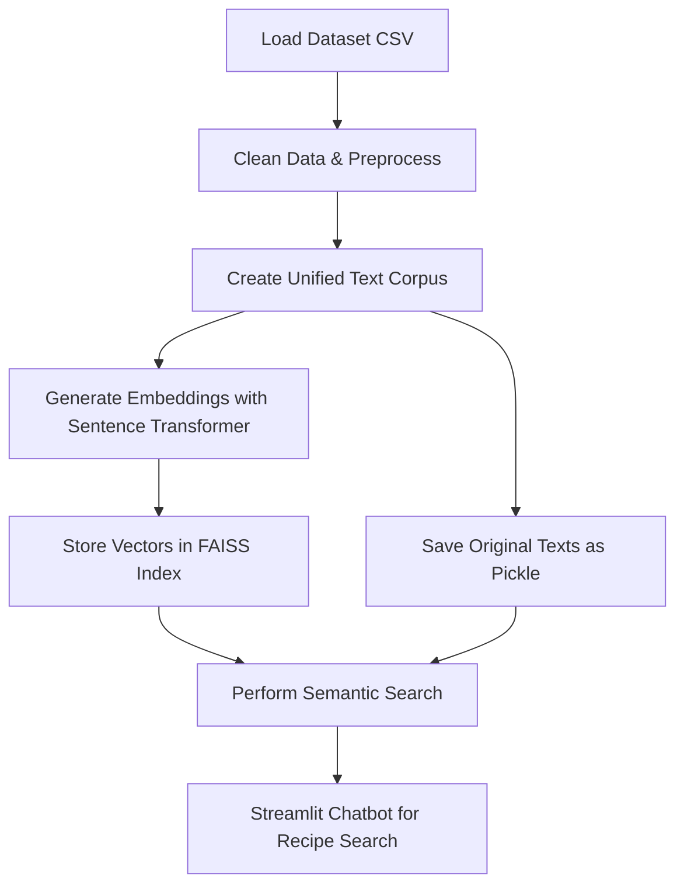

# 🍲 Recipe Retrieval-Augmented Generation (RAG) Chatbot

This project is a **Recipe Retrieval-Augmented Generation (RAG) system** that allows users to search and explore cooking recipes using **semantic search** powered by **FAISS** and **Sentence Transformers**.  
It also comes with a **Streamlit-based web app** for interactive recipe search and chatbot experience.

---

## ✨ Live Demo

You can try the live application, deployed via Streamlit, using the link below.

**[➡️ Visit the Live Recipe Assistant Here! ⬅️](https://cookingrecipechatbot.streamlit.app/)**  

!!Please use English command because of limited dataset and open using PC/Laptop is recommended!!

### 📌 Example Conversation Results

<details>
<summary>Click to expand full conversation 📜</summary>

<div style="max-height: 360px; overflow: auto; border: 1px solid #0b1220;; border-radius: 10px; padding: 12px; background: #e5e7eb;">
<pre style="margin:0; white-space: pre-wrap; word-wrap: break-word; color: #0b1220; font-size: 14px; line-height: 1.45;">
🤖 Bot: Hello! 👋 What would you like to do today? You can choose an option below or type your question directly.
🙋 User: Check Ingredients

🤖 Bot: Sure! What is the name of the recipe you want to check?
🙋 User: fried rice

🤖 Bot: Here are the ingredients for **Mexican Fried Rice**:
- 1 c. raw rice 1/4 c. oil 1 Tbsp. chili powder 2 c. water 1 tsp. salt
🤖 Bot: Do you want to see another recipe? (yes/no)

🙋 User: yes

🤖 Bot: Here are the ingredients for **Chinese Fried Rice**:
- chopped carrots
- boiled until almost tender rice
- boiled 1 onion
- chopped 2 to 3 slices bacon
- chopped 1 spoon dark soya sauce some small shrimp 2 dried mushrooms
- slices and/or whole) green peas
🤖 Bot: Do you want to see another recipe? (yes/no)

🙋 User: no
🤖 Bot: Okay! You can type another recipe name anytime. 🍳

---

🙋 User: Check Cooking Steps
🤖 Bot: Sure! What is the name of the recipe you want to check?

🙋 User: meatball
🤖 Bot: Here are the cooking steps for **Meatballs**:
1. Mix all ingredients thoroughly
2. Broil 7 to 10 minutes on each side
3. Eat as is or use with your favorite sauces
4. Makes 32 (1-inch) balls or 16 (2-inch) balls.
🤖 Bot: Do you want to see another recipe? (yes/no)

🙋 User: yes
🤖 Bot: Here are the cooking steps for **Cocktail Meatballs**:
1. Mix first 8 ingredients and shape into balls
2. Brown in skillet; remove fat
3. Heat chili sauce and jelly, stirring constantly until jelly is melted
4. Add meatballs; stir carefully until coated
5. Simmer uncovered 30 minutes
6. Serve hot
7. (We use a crock-pot.)
🤖 Bot: Do you want to see another recipe? (yes/no)

🙋 User: no
🤖 Bot: Okay! You can type another recipe name anytime. 🍳

---

🙋 User: thank you
🤖 Bot: You're welcome! Let me know if you need anything else. 🍀

---

🙋 User: i want to make salad
🤖 Bot: To make **Raw Vegetable Salad**, you have to prepare these ingredients:
- 1 head cauliflower
- cut up 1 bunch broccoli
- cut up 1 pkg. frozen peas onion
- chopped 1 c. mayonnaise 1 c. sour cream 1 tsp. vinegar 1 tsp. Worcestershire sauce salt and pepper to taste

🤖 Bot: After preparing the ingredients, you can follow these cooking steps:
1. Combine mayonnaise, sour cream, vinegar and Worcestershire sauce until mixed
2. Toss with vegetables, salt and pepper
3. Chill well
4. Serve.
🤖 Bot: Do you want to see another recipe? (yes/no)

🙋 User: no
🤖 Bot: Okay! You can type another recipe name anytime. 🍳

---

🙋 User: give me pizza ingredients
🤖 Bot: Here are the ingredients for **Pizza Hot Dish**:
- 1 lb. hamburger or sausage or half and half 1 lb. cooked spiral noodles (half cooked) 4 oz. pepperoni small can drained mushrooms 1/2 green pepper
- chopped 1 onion
- chopped 1/2 c. sliced green olives 1/2 c. sliced black olives salt and pepper to taste 1 can pizza sauce 1/2 to 1 can Hunts 4 cheese spaghetti sauce 16 oz. shredded Mozzarella cheese
🤖 Bot: Do you want to see another recipe? (yes/no)

🙋 User: yes
🤖 Bot: Here are the ingredients for **Zesty Pizza Sauce**:
- 1 cup Onion
- Chopped 2 cloves Garlic
- Minced 1/4 cups White Wine 4 Tablespoons Tomato Paste 4 teaspoons Dried Oregano 2 teaspoons Crushed Red Pepper 1/2 teaspoons Pepper 2 cans (28 Oz. Each) Crushed Tomatoes
- Undrained 1 teaspoon Sugar 2 teaspoons Balsamic Vinegar (optional)
🤖 Bot: Do you want to see another recipe? (yes/no)

🙋 User: no
🤖 Bot: Okay! You can type another recipe name anytime. 🍳

---

🙋 User: hello
🤖 Bot: Hi there! 😊 How can I help you with your cooking today?
</pre>
</div>

</details>

---

## 🚀 Key Features

-   **Natural Language Search**: Ask anything, like "how to make pancakes" or "chocolate cake ingredients".
-   **Comprehensive Information**: Get a clear list of ingredients and step-by-step cooking directions.
-   **Interactive Interface**: A modern and user-friendly chatbot interface powered by Streamlit.
-   **Fast Search**: Utilizes FAISS for lightning-fast recipe searches, even with tens of thousands of records.

---

## ⚙️ Tech Stack

-   **Frontend**: Streamlit
-   **Data Processing**: Pandas, NumPy
-   **Embedding Model**: Sentence Transformers (`all-MiniLM-L6-v2`) from Hugging Face
-   **Vector Database**: FAISS (Facebook AI Similarity Search)
-   **Backend Logic**: Python

---

## 📚 Dataset

This project uses the **RecipeNLG Dataset**, a large-scale dataset containing over 2 million cooking recipes with titles, ingredients, and instructions.  
It is available on Kaggle:  
🔗 [RecipeNLG Dataset on Kaggle](https://www.kaggle.com/datasets/paultimothymooney/recipenlg)

---

## 📊 End-to-End Data Pipeline Flowchart



---

## 🛠️ How It Works

This project implements a simple RAG architecture for a recipe search system.

1.  **Indexing Pipeline (Offline)**:
    -   The recipe dataset is first cleaned, where relevant columns like title, ingredients, and directions are combined into a single text document for each recipe.
    -   Each of these text documents is then converted into a numerical representation (a vector) using the `all-MiniLM-L6-v2` model. This vector captures the semantic meaning of each recipe.
    -   All recipe vectors are stored in a FAISS index. FAISS allows us to search for the most similar vectors with incredible speed.

2.  **Retrieval Pipeline (Online)**:
    -   When you type a query into the Streamlit app, your query is also converted into a vector using the same model.
    -   This query vector is then used to find the most similar recipe vectors (those that are geometrically closest) within the FAISS index.
    -   After retrieving the most relevant recipes, the application fetches their original text and displays it to you in a user-friendly format.

---

## 💻 Local Installation & Setup

To run this project on your local machine, follow these steps:

1.  **Clone this repository:**
    ```bash
    git clone https://github.com/wandaarma/CookingRecipeChatbot_RAG.git
    cd CookingRecipeChatbot
    ```

2.  **Create and activate a virtual environment (recommended):**
    ```bash
    python -m venv venv
    # Windows
    venv\Scripts\activate
    # macOS / Linux
    source venv/bin/activate
    ```

3.  **Install all required dependencies:**
    ```bash
    pip install -r requirements.txt
    ```

4.  **Run the Notebook to process the data:**
    Open and run `rag_recipes.ipynb` to generate the necessary artifact files, such as `recipe_faiss.index`, `cleaned_recipes.pkl`, and the `model` directory.

5.  **Run the Streamlit application:**
    Ensure all artifact files are in the same directory, then run:
    ```bash
    streamlit run app.py
    ```
---

## 📂 Important Project Structure
```
.
├── 📄 aglio.jpg               # Asset 
├── 📄 app.py                  # Main Streamlit application code
├── 📄 rag_recipes.ipynb       # Notebook for data processing and indexing
├── 📄 requirements.txt        # List of Python dependencies
├── 📄 recipe_faiss.index      # The generated FAISS index file
├── 📄 cleaned_recipes.pkl     # The cleaned recipe data file
└── 📄 README.md               # This file
```